#### My projects:

##### [Taskbar backend](https://gitfront.io/r/Elendiar/sSercQt2v2ZN/production-taskbar/)

Admin page and project visualisation

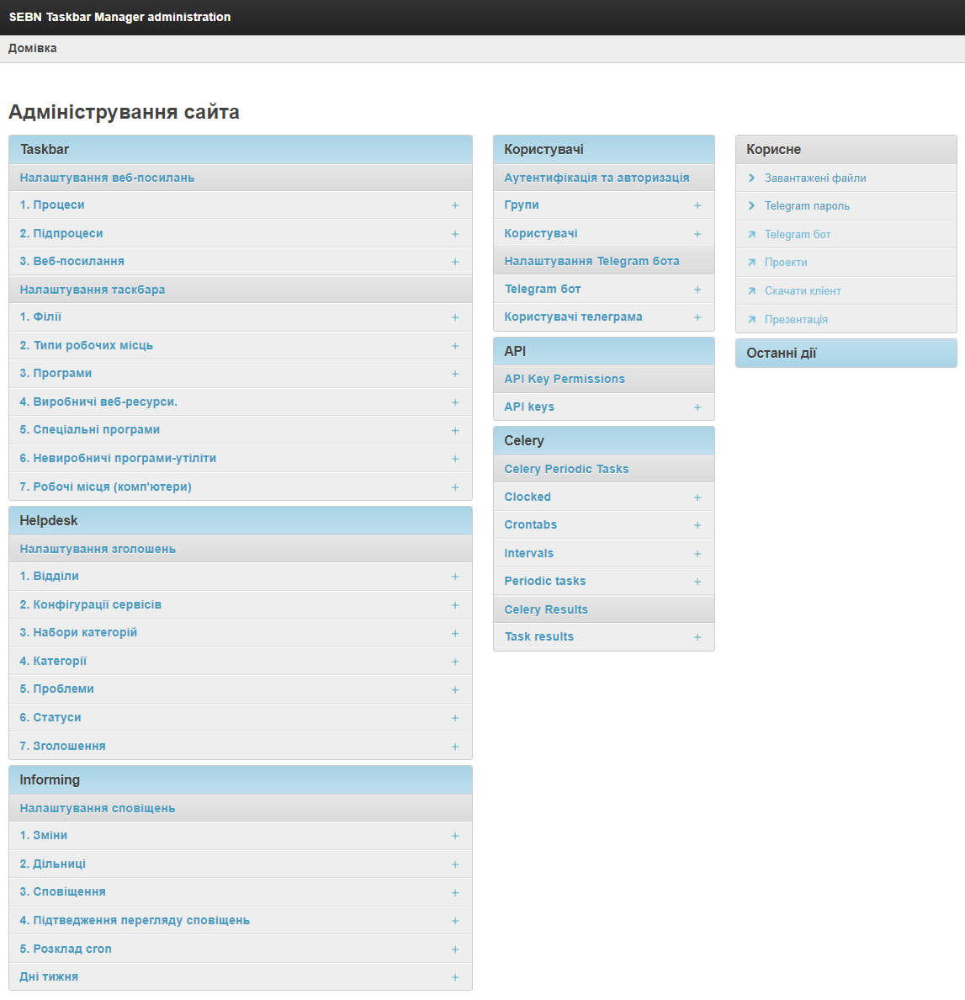
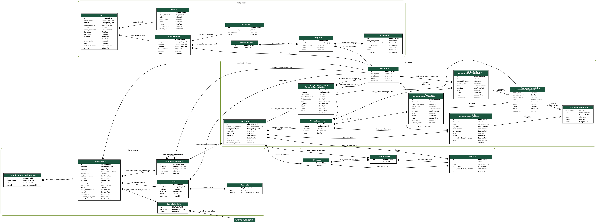

##### [Taskbar client](https://gitfront.io/r/Elendiar/21SQq6UV13ja/production-taskbar-client/)

Screenshots

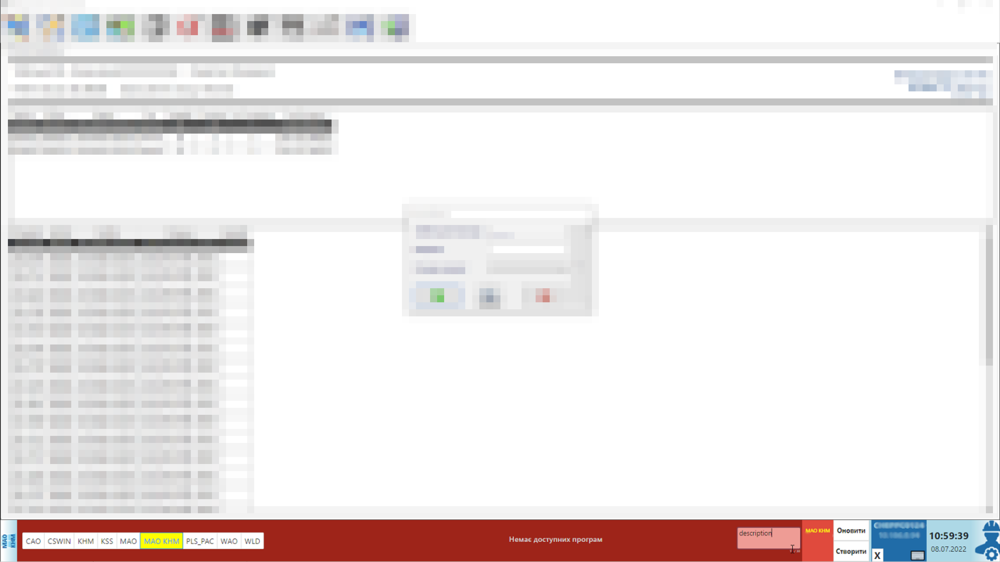
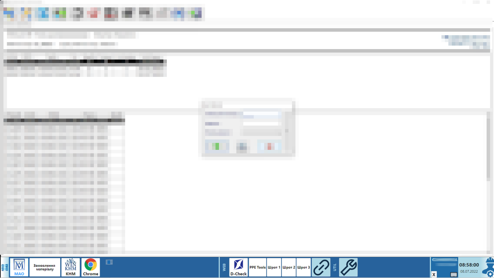
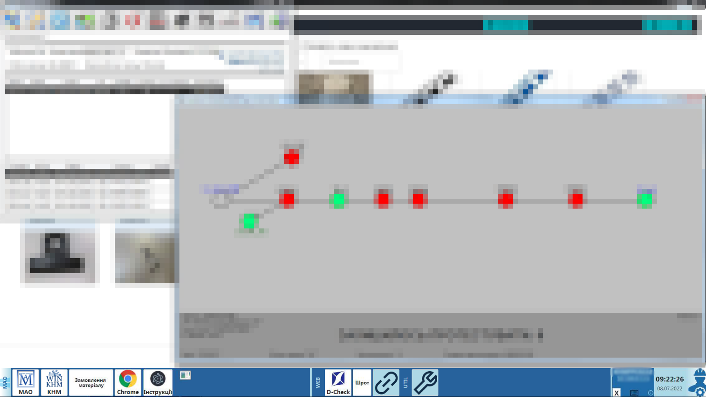

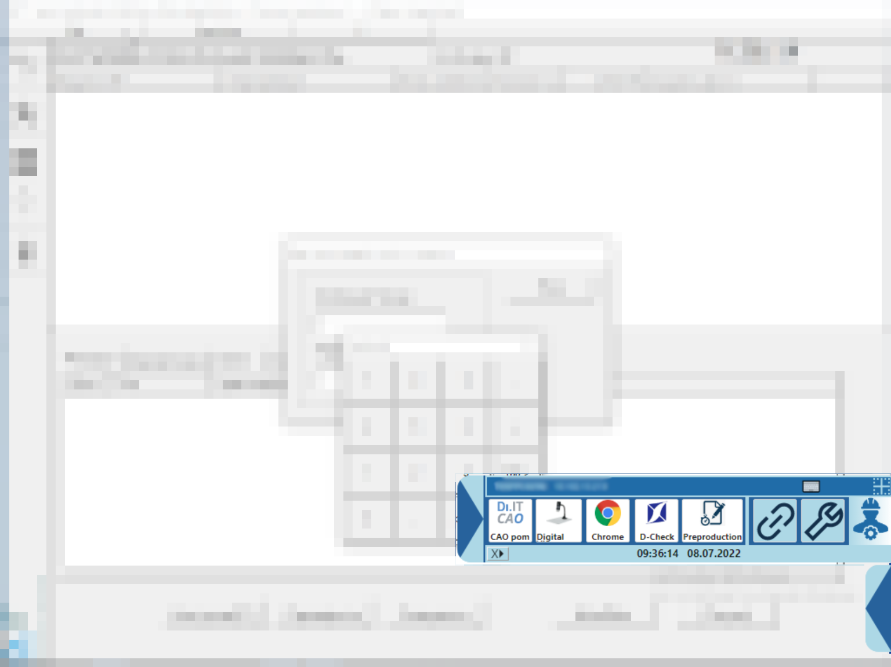
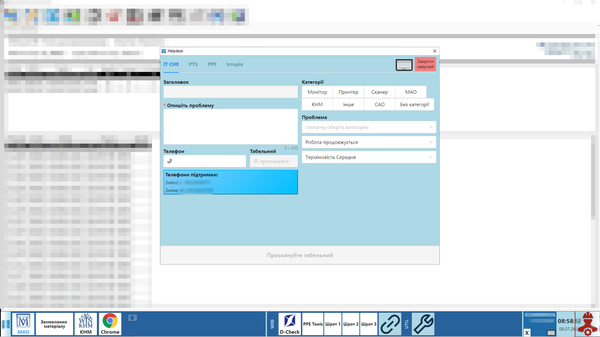
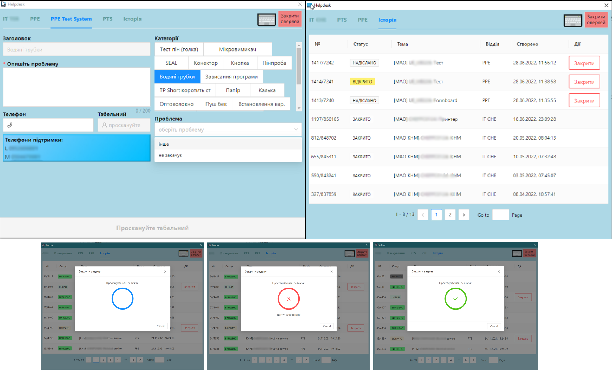

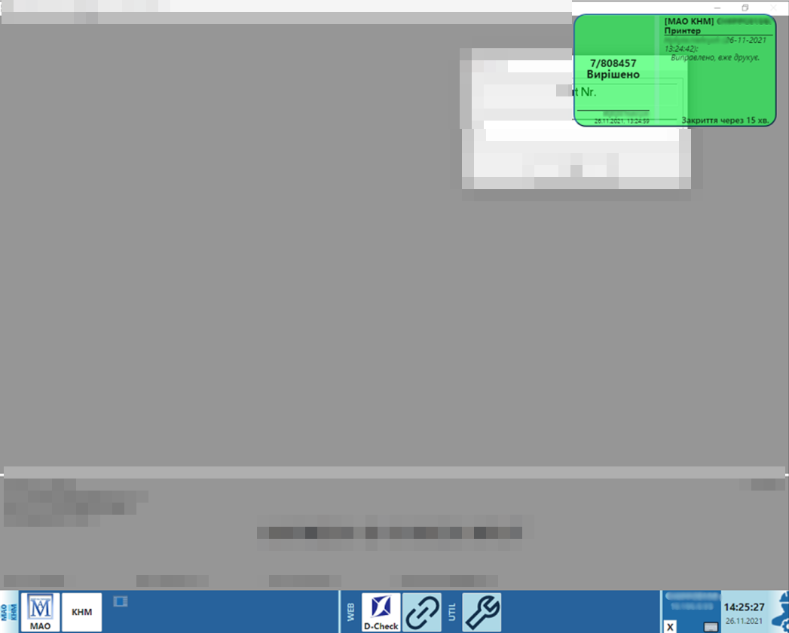
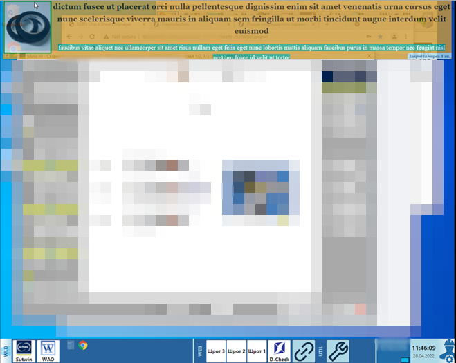
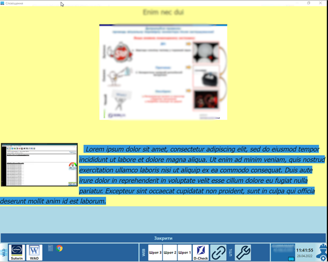

##### [Inventory client](https://gitfront.io/r/Elendiar/8tJZd3d4Gms3/inventory/)

Video demo

[Android 1](/assets/inventory-client/inv-android-emulator_01.mkv)
[Android 2](/assets/inventory-client/inv-android-emulator_02.mkv)
[Android 3](/assets/inventory-client/inv-android-emulator_03.mkv)
[Web version](/assets/inventory-client/inv-web.mkv)

##### Speedometer

Screenshots

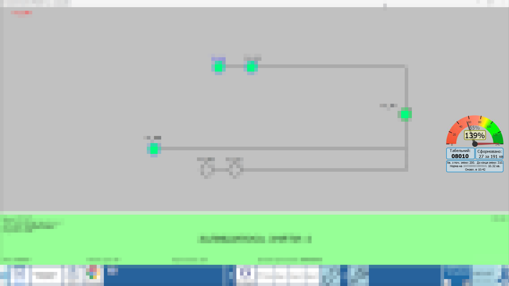

